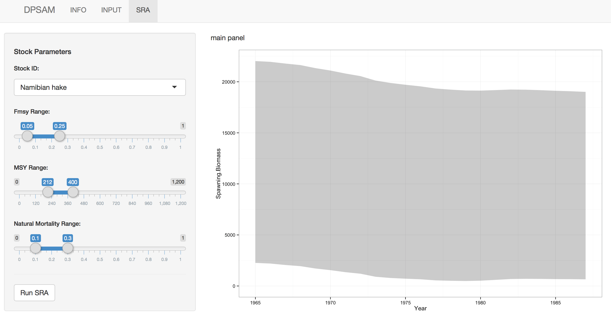

## Stock Reduction Analysis
---
The sliders for Fmsy, MSY, and Natural Mortality Rate represent the range of alternative hypotheses for each of these parameters.  They also conveniently define the prior range of spawning biomass estimates.  When adjusting the sliders the graphics are updated to reflect the possible range of spawning biomass trajectories that are possible given the defined parameter range.  This is extremely useful for establishing the minimum values of Fmsy, MSY, and Natural mortality rates that are required for the deterministic model to remain extant.  The color of the shaded region indicates if the minimum spawning stock biomass remains extant ("green shading"), or goes extinct before the end of the time series ("red shading").

---
